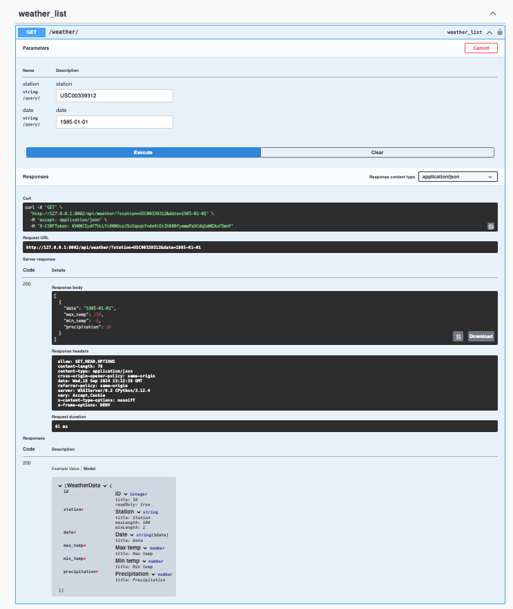
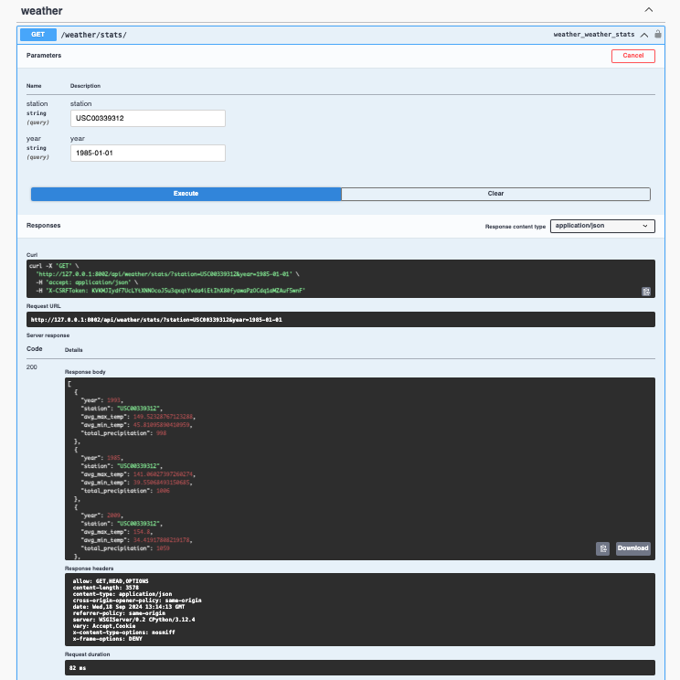

# Weather Data API

## Overview
This project is a RESTful API for weather data and statistics using Django and Django REST Framework (DRF). The API allows users to query weather data by station and date and also provides aggregated statistics like average temperature and total precipitation.

## Features
- Retrieve weather data filtered by station and date.
- Fetch weather statistics (average temperature and total precipitation) filtered by station and year.
- Pagination for large datasets.
- Swagger UI available for easy exploration of the API.

## Technologies Used
- **Django**: Web framework for building the application.
- **Django REST Framework (DRF)**: Framework for building the RESTful API.
- **drf-yasg**: Library to automatically generate Swagger/OpenAPI documentation.
- **PostgreSQL**: Relational database to store weather data.

## Setup Instructions

### 1. Clone the Repository
```bash
git clone <repository-url>
cd weather_project
```

### 2. Create a Virtual Environment and Activate it
```bash
python3 -m venv venv
source venv/bin/activate
```

### 3. Install Dependencies
```bash
pip install -r requirements.txt
```

### 4. Set Up the Database
Make sure PostgreSQL is installed and running. Create a database named weather_db.
```bash
createdb weather_db
```
### 5. Apply Migrations
Run the following command to create the necessary tables in the database:
```bash
python manage.py migrate
```

### 6. Populate the Database 
If you have a .txt file with weather data, you can populate the database by creating a custom management command or importing data via the Django admin.

### 7. Run the Development Server
```bash
python manage.py runserver
```

### 8. Access the Swagger UI
You can access the Swagger UI to explore the API documentation:

```bash
http://127.0.0.1:8000/swagger/
```

## API Endpoints
#### 1. Weather Data API

Method: GET 
```code
/api/weather/?station=station_name&date=targeted_date
``` 

##### Query Parameters:
- station (string): The station ID to filter the weather data.
- date (string): The date in YYYY-MM-DD format to filter the weather data.
- Example: Assume station name and targeted date as a variable for above parameters. Check below for the given example to be considered. 
```csv
station_name = USC00333758
date = 19850101
```

##### Response Example:

```json 
[
  {
    "station": "USC00339312",
    "date": "1985-01-01",
    "max_temp": 15,
    "min_temp": 10,
    "precipitation": 20
  }
]
```

#### 2. Weather Statistics API
Method: GET
```code
 /api/weather/stats/
```

##### Query Parameters:
- station (string): The station ID to filter the weather stats.
- year (string): The year to filter the weather stats.
- Example: Assume station name and targeted date as a variable for above parameters. Check below for the given example to be considered. 
```csv
station_name = USC00333758
date = 19850101
```

##### Response Example:

```json
[
  {
    "year": 1985,
    "station": "USC00339312",
    "avg_max_temp": 18,
    "avg_min_temp": 10,
    "total_precipitation": 300
  }
]
```

## Error Handling and Edge Cases
The API handles edge cases and potential errors using try-except blocks where appropriate, ensuring that the system can handle missing or incorrect input gracefully.

#### 1. Invalid Station or Date:
If the station or date is invalid or not found in the database, the API will return a 404 error with a message indicating the issue.
- Example:
```bash
{
  "detail": "Station or date not found"
}
```

#### 2. Malformed Requests:
If the client sends a request with an invalid query parameter format (e.g., non-existent date format), the API will catch this using try-except and respond with a 400 error (Bad Request).
- Example: 
```python 
try:
    # Code to filter and fetch data
except ValueError as e:
    return JsonResponse({"error": "Invalid date format"}, status=400)
```
#### 3. Handling Missing Query Parameters:
The API ensures that if required query parameters like station or date are missing, a clear and informative error message will be returned.

- Example: 
```python
if not station or not date:
    return JsonResponse({"error": "Both station and date parameters are required"}, status=400)
```
#### 4. Pagination Edge Cases:
If a user requests a page that does not exist (e.g., page number too high), the API handles it with proper exception handling and returns the appropriate response.
- Example:
```python
try:
    results = paginator.page(page)
except PageNotAnInteger:
    results = paginator.page(1)
except EmptyPage:
    results = paginator.page(paginator.num_pages)
```   


## Outcome
- Successfully created a RESTful API to handle weather data and statistics.
- Implemented pagination to efficiently manage large datasets.
- Integrated Swagger for automated API documentation.
- Handled various edge cases using try-except for robust error handling


## Screenshots
- Swagger UI .png)
- Weather Execution 
- Weather Stats Execution 


## Requirements
```txt
pandas==2.0.3
psycopg2==2.9.6
Django==4.2.5
djangorestframework==3.14.0
drf-yasg==1.21.7
psycopg2-binary==2.9.6
django-filter==23.1
gunicorn==20.1.0
python-dotenv==1.0.0
```

## Conclusion
This project provides a comprehensive solution for weather data retrieval and weather statistics calculation, complete with a REST API and Swagger documentation for easy access. The API efficiently handles large datasets with pagination and can be easily integrated into any data pipeline.


## Final Instructions: 
1. Copy and paste this entire markdown content into your `README.md`.
2. Place the screenshots in a folder named `screenshots` inside your project directory to match the paths used in the README.
3. Once ready, proceed with pushing to your `improvement` branch and later merge into the `main` branch.

